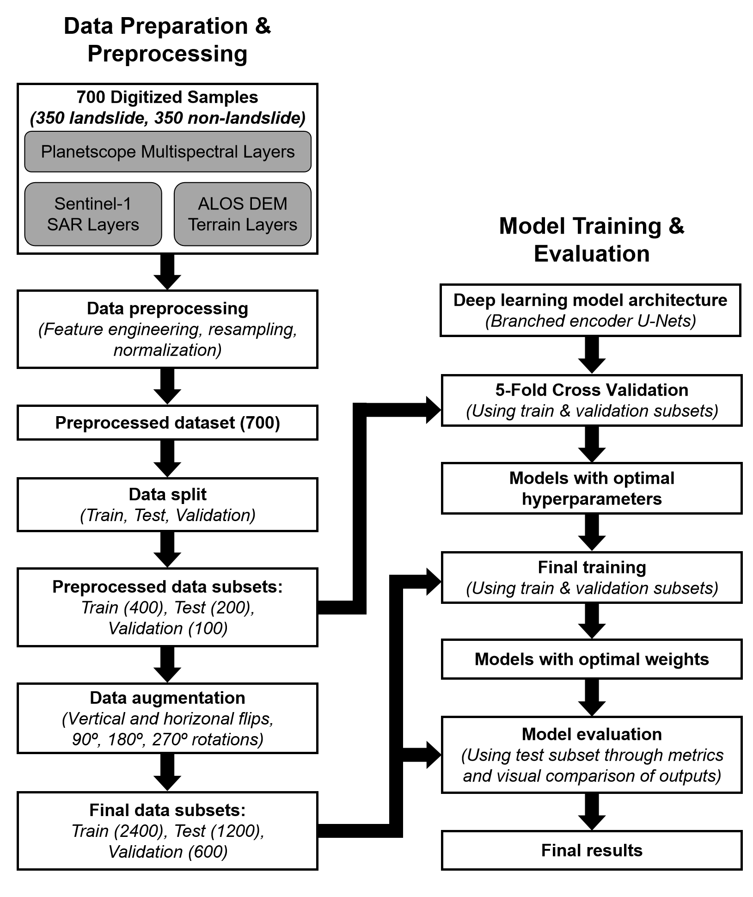
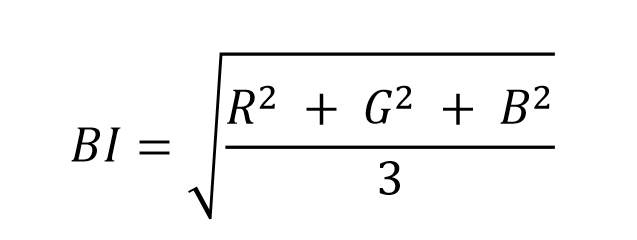
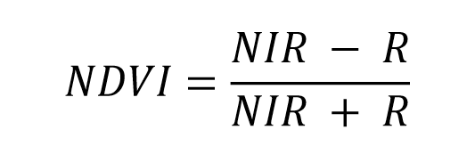
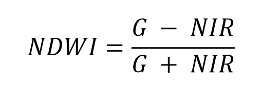
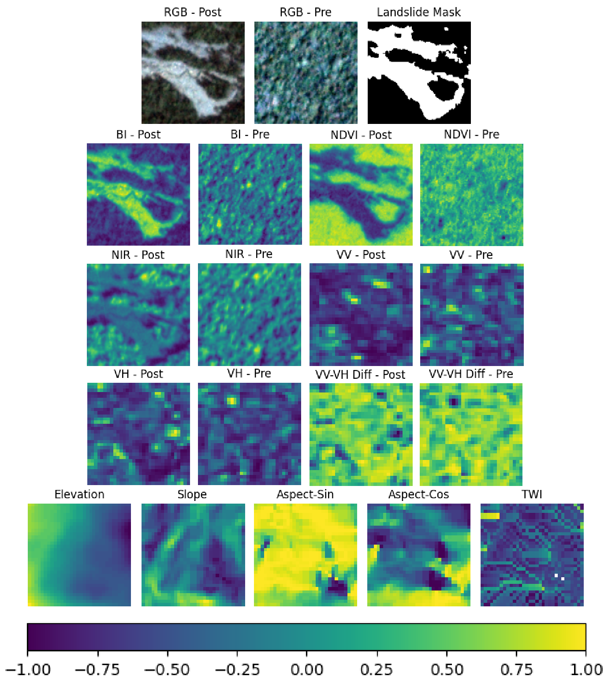
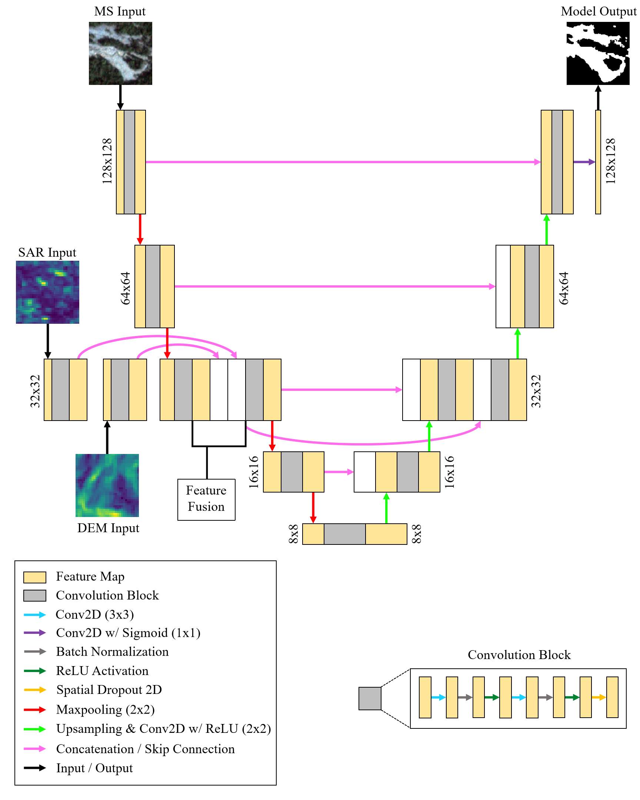
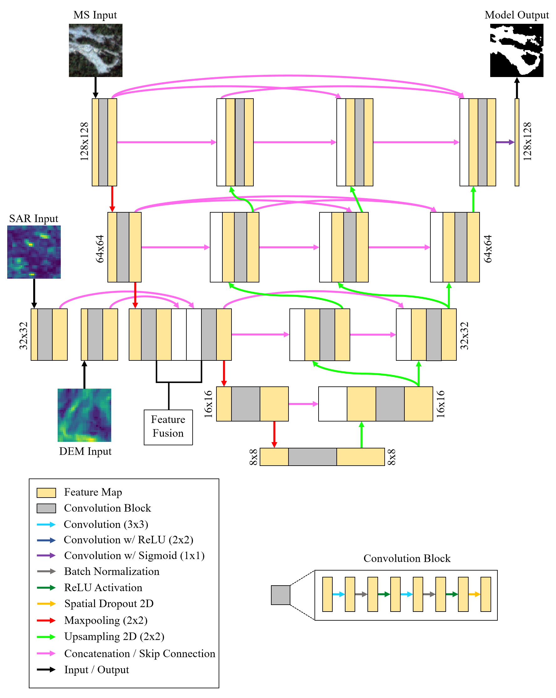
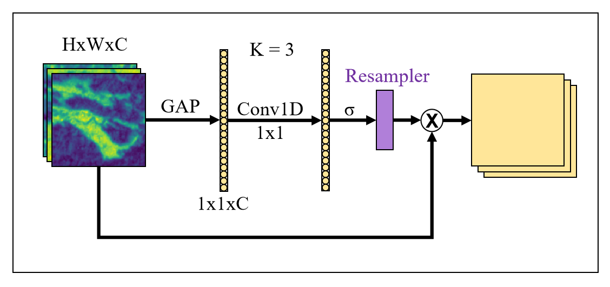
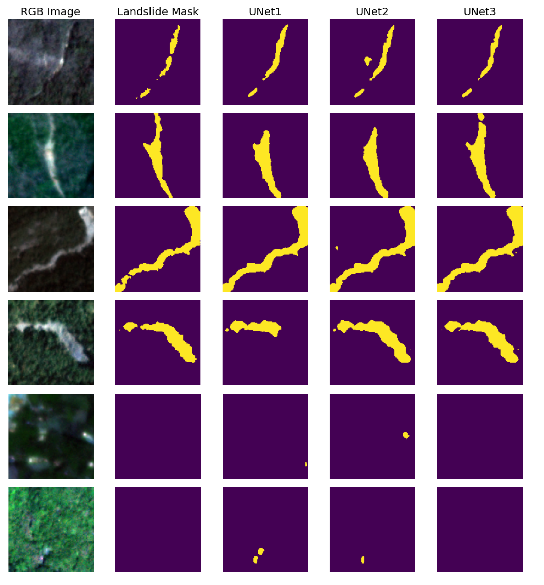

# Landslide Mapping in Kerala, India From Multi-Modal Remote Sensing Data Using Branched Encoder U-Net

## Overview
Landslide detection and mapping are crucial for hazard assessment and disaster management.
This project implements deep learning–based branched segmentation models to map landslides from multi-sensor satellite data.

## Objectives
- Prepare a landslide dataset from Kerala, India involving data from multiple satellite sensors.
- Implement branched U-Net models for mapping landslides from this dataset.
- Compare model performance using visual comparison and evaluation metrics. 

<p align="center">
  
  <br>
  <em>Figure 1. Block diagram showing the methodology of the study.</em>
</p>

## Study Area
Study area covers the landslide-prone Western Ghats region in Kerala, India characterized by dissected hills, valleys, and plateau along with monsoon-driven rainfall.
<p align="center">
  
  <br>
  <em>Figure 2. a). Location and physiography of Kerala, India; b). Geomorphology map showing the Western Ghats region in Kerala.</em>
</p>

## Dataset

### Sources
- PlanetScope 3 meter multi-spectral imagery: post-event and pre-event.
- Sentinel-1 10 meter SAR (Synthetic Aperture Radar) imagery: post-event and pre-event.
- ALOS DEM (Digital Elevation Model) 12.5 meter layers.

### Features
- PlanetScope: NIR (Near-Infrared), BI (Brightness Index), NDVI (Normalized Difference Vegetation Index), NDWI (Normalized Difference Water Index). Blue (B), green (G), and red (R) bands were removed from the data due to high correlation in between them as well as with the indices, which can lead to redundancy.
- Sentinel-1: VV, VH, VV-VH (band-wise difference)
- ALOS DEM: Elevation, Slope, Aspect, TWI (Topographic Wetness Index)

<p align="center">
  
  <br>
  <em>Figure 3. Equation for Brightness Index (BI), where R, G, and B stands for Red, Green, and Blue bands respectively.</em>
</p>

<p align="center">
  
  <br>
  <em>Figure 4. Equation for Normalized Difference Vegetation Index (NDVI), where NIR and R stands for Near-Infrared and Red bands respectively.</em>
</p>

<p align="center">
  
  <br>
  <em>Figure 5. Equation for Normalized Difference Water Index (NDWI), where G and NIR stands for Green and Near-Infrared bands respectively.</em>
</p>

### Data Preprocessing
- 700 samples were digitized from the study area (350 landslide and 350 non-landslide samples).
- They were divided into 400 samples for training (200 landslide & 200 non-landslide), 200 samples for testing (100 each) and 100 for validation (50 each).
- For each sample, the Planetscope layers (3 meter) were tiled to 128x128 patches (2<sup>7</sup>), covering an area of 384 meter in length and width (128 × 3). The Sentinel-1 SAR layers (10 meter) covered the same spatial extent with 38x38 tiles (≈384 ÷ 10) while ALOS DEM layers (12.5 meter) covered it with 31x31 tiles (≈384 ÷ 12.5). To ensure dimensional consistency and compatibility across inputs, both DEM and SAR layers were resampled to a standardized dimension of 32x32 (2<sup>5</sup>) using the bilinear interpolation method.
- The values in each channel / band was normalized to the range of -1 to 1, with -9 being the placeholder for pixels with no data (Nan, 0, -9999).
- Aspect is an angular (circular) variable with 0 to 360 degree range. Since min-max normalization would misrepresent the directional information in it, aspect was transformed using its sine and cosine components, which has the range -1 to 1 and capture the circular nature.
- Since NDVI and NDWI are already in the range of -1 to 1, normalization was not applied to them.

<p align="center">
  
  <br>
  <em>Figure 6. Input layers for a sample landslide patch along with the binary landslide mask. Landslide and non-landslide pixels in the mask are shown in white and black colors respectively. True-color composites (RGB) are used only for visualization purposes and are not model inputs.</em>
</p>

## Models
For this study, 3 variants of the branched U-Net algorithm were used:
- Triple Encoder U-Net
- Triple Encoder U-Net++
- Triple Encoder U-Net++ with ECA (Efficient Channel Attention)

For convenience, these models will be often called UNet1, UNet2, and UNet3 respectively.

<p align="center">
  
  <br>
  <em>Figure 7. Architecture of the Triple Encoder U-Net employed in this study.</em>
</p>

<p align="center">
  
  <br>
  <em>Figure 8. Architecture of the Triple Encoder U-Net++ employed in this study.</em>
</p>

<p align="center">
  
  <br>
  <em>Figure 9. Diagram of ECA used in this study.</em>
</p>

## Training and Evaluation
- 5-Fold Cross Validation (5-Fold CV) was done for each model on the training and validation sets with 48 different sets of parameters.
- The parameter set that gave the most robust performance (metrics with least standard deviation) for each algorithm was used for final training.
- Final training was done on the whole dataset after augmentation (90, 180, and 270 degree rotations, vertical and horizontal flips).
- Models were evaluated qualitatively using visualization of predictions, and quantitatively using metrics.
- Evaluation metrics: precision, recall, F1 score, IoU (Intersection over Union), MCC (Matthew's Correlation Coefficient). 

<p align="center"><b>Table 1. Training Parameters.</b></p>

<table align="center">
  <tr>
    <th>Parameter</th>
    <th>Value</th>
  </tr>
  <tr>
    <td>Filters</td>
    <td>8, 16, 32</td>
  </tr>
  <tr>
    <td>Batch size</td>
    <td>4, 8, 16, 32</td>
  </tr>
  <tr>
    <td>Learning rate</td>
    <td>1e-4, 5e-4, 1e-5, 5e-5</td>
  </tr>
  <tr>
    <td>Epochs</td>
    <td>20 to 200</td>
  </tr>
  <tr>
    <td>Optimizer</td>
    <td>Adam</td>
  </tr>
  <tr>
    <td>Loss function</td>
    <td>Tversky loss</td>
  </tr>  
</table>

<p align="center"><b>Table 2. Parameters That Gave Best Performance for Each Model.</b></p>

<table align="center">
  <tr>
    <th>Model</th>
    <th>Algorithm</th>
    <th>Filters</th>
    <th>Batch Size</th>
    <th>Learning Rate</th>
  </tr>
  <tr>
    <td>Unet1</td>
    <td>Triple Encoder U-Net</td>
    <td>16</td>
    <td>4</td>
    <td>1e-4</td>
  </tr>
  <tr>
    <td>UNet2</td>
    <td>Triple Encoder U-Net++</td>
    <td>32</td>
    <td>8</td>
    <td>5e-4</td>  </tr>
  <tr>
    <td>UNet3</td>
    <td>Triple Encoder U-Net++ w/ ECA</td>
    <td>32</td>
    <td>32</td>
    <td>5e-4</td>  </tr>
</table>

## Results
- UNet3 (Triple Encoder U-Net++ w/ ECA) gave the best performance in the final training with 90.3% Recall and 86% F1 Score. It also was the most robust in the 5-Fold CV with 83.71±0.52 F1 Score.
- Figure 5 shows some of the test samples along with their landslide mask and model predictions. This also shows exceptional performance from UNet3.

<p align="center"><b>Table 3. 5-Fold CV Results.</b></p>

<table align="center">
  <tr>
    <th>Model</th>
    <th>Precision</th>
    <th>Recall</th>
    <th>F1</th>
    <th>IoU</th>
    <th>MCC</th>
  </tr>
  <tr>
    <td>UNet1</td>
    <td>80±1.9</td>
    <td>84.7±2.3</td>
    <td>82.24±1</td>
    <td>69.85±1.43</td>
    <td>81.02±0.92</td>
  </tr>
  <tr>
    <td>UNet2</td>
    <td>80.8±2.7</td>
    <td>90.06±2.5</td>
    <td>85.11±1</td>
    <td>74.09±1.5</td>
    <td>84.19±0.89</td>
  </tr>
  <tr>
    <td>UNet3</td>
    <td>77.63±4.7</td>
    <td>91.48±5.04</td>
    <td><b>83.71±0.52</b></td>
    <td><b>72±0.77</b></td>
    <td><b>82.94±0.48</b></td>
  </tr>
</table>

<p align="center"><b>Table 4. Final Training Results. The suffix of each model denotes the number of epochs for which final training was done.</b></p>

<table align="center">
  <tr>
    <th>Model<sub>Epoch</sub></th>
    <th>Precision</th>
    <th>Recall</th>
    <th>F1</th>
    <th>IoU</th>
    <th>MCC</th>
  </tr>
  <tr>
    <td>UNet1<sub>200</sub></td>
    <td>83.91</td>
    <td>84.06</td>
    <td>84</td>
    <td>72.39</td>
    <td>83.03</td>
  </tr>
  <tr>
    <td>UNet2<sub>100</sub></td>
    <td>79.86</td>
    <td>91.28</td>
    <td>85.2</td>
    <td>74.2</td>
    <td>84.45</td>
  </tr>
  <tr>
    <td>UNet3<sub>100</sub></td>
    <td>82.21</td>
    <td>90.3</td>
    <td><b>86.06</b></td>
    <td><b>75.54</b></td>
    <td><b>85.3</b></td>
  </tr>
</table>

<p align="center">
  
  <br>
  <em>Figure 6. Selected landslide samples along with their respective ground truth masks and predictions from each model .</em>
</p>


## Usage
Use the Jupyter notebook `Model_Testing.ipynb` to read and visualize the sample datasets, load the models with pretrained weights, evaluate the models on the sample dataset, and visualize the results.

## Data Availability
Due to size constraints, the full dataset is not included in this repository.
A small sample dataset is provided under `Data`.

## Model Weights
Pretrained model weights are not tracked in the repository due to size limits. They are provided via GitHub Releases → v0.1.0 (pre-release).

## Requirements
- Python 3.10
- Tensorflow 2.8.0

## Installation
```bash
git clone https://github.com/AbhilashGeoWork/Landslide_DL_KL.git
cd Landslide_DL_KL
pip install -r requirements.txt
```

## License
This project is licensed under Apache License 2.0.

## Contact
Abhilash Sreekumar  
- Email: abhilashgeowork@gmail.com
- LinkedIn: abhilash-sreekumar

## Acknowledgment
- This project was done under the supervision and guidance of **Dr. Hemalatha T.** and **Maneesha Vinodini Ramesh** (*Center  for Wireless Networks and Applications (WNA), Amrita Viswa Vidyapeetham, Amritapuri, India*) in collaboration with **Dr. Sansar Raj Meena** (*Università degli Studi di Padova*).
- PlanetScope data were provided by Planet Labs PBC through the Planet Research Program. Citation: Planet Labs PBC. (2024). Planet Application Program Interface: In Space for Life on Earth. https://api.planet.com